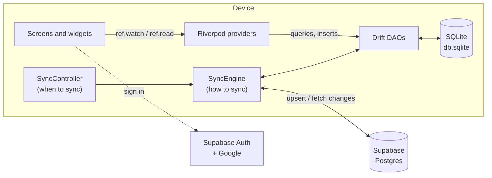
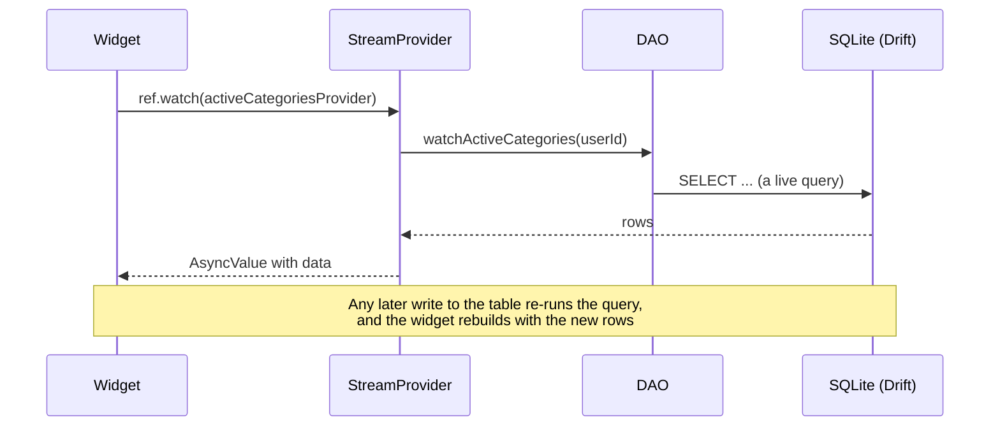
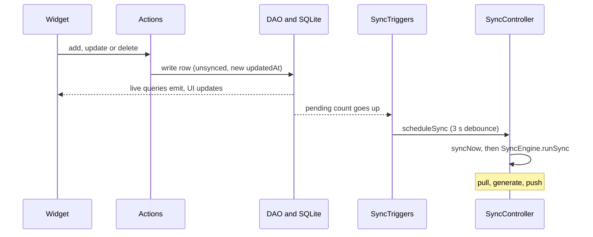
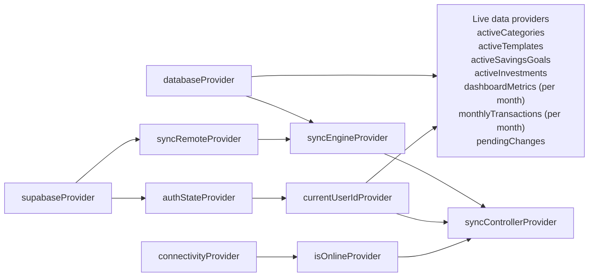
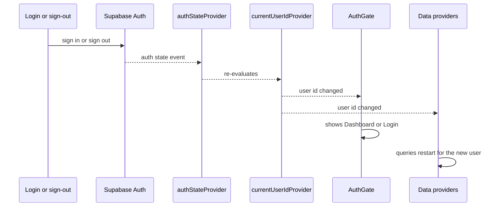

# Architecture

**Contents**

- [The big picture](#the-big-picture)
- [Layers](#layers)
- [How data flows](#how-data-flows)
- [Riverpod provider graph](#riverpod-provider-graph)
- [App startup](#app-startup)
- [Authentication and the signed-in user](#authentication-and-the-signed-in-user)
- [Conventions](#conventions)

---

## The big picture

The app is **offline-first**. The screens never talk to the network. They read and write a local SQLite
database (through Drift), and a separate **sync engine** copies changes to and from Supabase in the
background.

The important consequence: **the UI never waits for Supabase**, and the network can fail at any time
without the user noticing anything but the cloud icon.

## Layers

| Layer | Where | Responsibility | Knows about |
|---|---|---|---|
| **UI** | `lib/screens`, `lib/widgets` | Draw state, react to taps | Providers only |
| **State** | `lib/providers` | Turn database streams into UI state; hold actions that change data | DAOs, Supabase client |
| **Data access** | `lib/daos`, `lib/database.dart` | Every SQL query, scoped by user | Drift |
| **Sync** | `lib/sync_engine.dart`, `lib/providers/sync_providers.dart` | Reconcile local rows with Supabase | DAOs, a `SyncRemote` |
| **Backend** | Supabase | Auth, durable storage shared by devices | n/a |

Rules that keep the layers honest:

- Widgets never call a DAO or `AppDatabase.instance` directly. They read a provider, or call an *Actions* class.
- DAOs never know about the signed-in user implicitly. Every query **takes a `userId`**.
- Only the sync engine talks to Supabase data. Only `AuthGate`/`Login` and the sign-out button touch Supabase Auth.

## How data flows

### Reading: the database drives the UI

Drift's `.watch()` re-emits whenever a table the query reads is written to. Riverpod's `StreamProvider`
carries each new list to the widgets watching it. Nobody has to say "refresh".

### Writing: actions, then the sync loop

A change is therefore visible **immediately**, and reaches Supabase a few seconds later, if the network allows.

## Riverpod provider graph

Providers are recipes; the values live in the `ProviderScope` created in `main()`. Arrows mean
"depends on" (`ref.watch`).

### Provider catalogue

| Provider | Type | Value | Defined in |
|---|---|---|---|
| `databaseProvider` | `Provider` | The `AppDatabase` singleton | `core_providers.dart` |
| `supabaseProvider` | `Provider` | The `SupabaseClient` | `core_providers.dart` |
| `authStateProvider` | `StreamProvider` | Supabase auth events | `core_providers.dart` |
| `currentUserIdProvider` | `Provider<String?>` | Signed-in user's ID, or `null` | `core_providers.dart` |
| `syncRemoteProvider` / `syncEngineProvider` | `Provider` | The Supabase-backed remote and the `SyncEngine` | `core_providers.dart` |
| `activeCategoriesProvider` | `StreamProvider` | Live list of the user's active categories | `category_providers.dart` |
| `activeTemplatesProvider` | `StreamProvider` | Live list of active fixed transactions | `template_providers.dart` |
| `activeSavingsGoalsProvider` | `StreamProvider` | Live list of active goals | `savings_goal_providers.dart` |
| `activeInvestmentsProvider` | `StreamProvider` | Live list of active investments | `investment_providers.dart` |
| `dashboardMetricsProvider` | `StreamProvider.autoDispose.family` | Income/expense/cash flow for a `(year, month)` | `transaction_providers.dart` |
| `monthlyTransactionsProvider` | `StreamProvider.autoDispose.family` | A month's transactions joined with their categories | `transaction_providers.dart` |
| `activeFilterProvider` | `NotifierProvider<…, String>` | The selected category chip (`"All"` by default) | `transaction_providers.dart` |
| `themeModeProvider` | `NotifierProvider<…, ThemeMode>` | Light, dark or system | `theme_provider.dart` |
| `connectivityProvider` / `isOnlineProvider` | `StreamProvider` / `Provider` | Whether the device has a network | `sync_providers.dart` |
| `pendingChangesProvider` | `StreamProvider<int>` | How many local rows are waiting to upload | `sync_providers.dart` |
| `syncControllerProvider` | `NotifierProvider<SyncController, SyncState>` | Sync status; the one place that decides *when* to sync | `sync_providers.dart` |
| `categoryActionsProvider`, `templateActionsProvider`, `savingsGoalActionsProvider`, `investmentActionsProvider`, `transactionActionsProvider` | `Provider` | The *Actions* classes that change data | `*_providers.dart` |

**Reading a provider**

| Call | Use it | Effect |
|---|---|---|
| `ref.watch(p)` | In `build()` or another provider | Subscribes; rebuilds when the value changes |
| `ref.read(p)` | In callbacks (`onPressed`), `initState`, actions | Reads once, no subscription |
| `ref.listen(p, ...)` | In `build()` | Runs a function on change, no rebuild (used for side effects like starting a sync) |

For a `Notifier`, `ref.watch(p)` returns the **state** and `ref.read(p.notifier)` returns the **object with
methods**, which is why you call `ref.read(themeModeProvider.notifier).toggle()`.

## App startup

`main()` in [`lib/main.dart`](../lib/main.dart):

1. `WidgetsFlutterBinding.ensureInitialized()`: the engine is ready before any async work.
2. `registerWindowsProtocol()`: on Windows, registers the OAuth redirect URL scheme.
3. `dotenv.load(".env")`: reads the Supabase and Google configuration.
4. `Supabase.initialize(...)`: restores any saved session.
5. `runApp(ProviderScope(child: TransactionApp()))`: `TransactionApp` builds the `MaterialApp`, with both
   themes and `themeMode` from `themeModeProvider`, and `AuthGate` as home.

The database is **not** opened at this point. `AppDatabase.instance` is created lazily, and the SQLite file
opens on the first query (`LazyDatabase`).

`AuthGate` then wraps the signed-in app in `SyncTriggers`, which starts the first sync after the first frame.

## Authentication and the signed-in user

`currentUserIdProvider` only notifies listeners when the **ID actually changes** (Riverpod compares the new
value to the old), so a routine token refresh doesn't rebuild the app.

Inside *actions* (add / update / delete), the user is read with `ref.requireUserId()`
([`core_providers.dart`](../lib/providers/core_providers.dart)), which throws a `StateError` if nobody is
signed in, because being signed out there is a bug, not a normal state.

## Conventions

- **Naming:** providers end in `Provider`; the change-making classes end in `Actions`.
- **User scoping:** every DAO query takes `userId`; every insert stamps it; edits to another user's row are refused.
- **Every local change** sets `isSynced = false` and moves `updatedAt` forward (see [Sync](sync.md#rules-for-changing-rows)).
- **Deletes are soft** (`isDeleted = true`), so they can sync.
- **Formatting** follows the existing code: braces on their own line, `// NOTE:` comments for the *why*.
