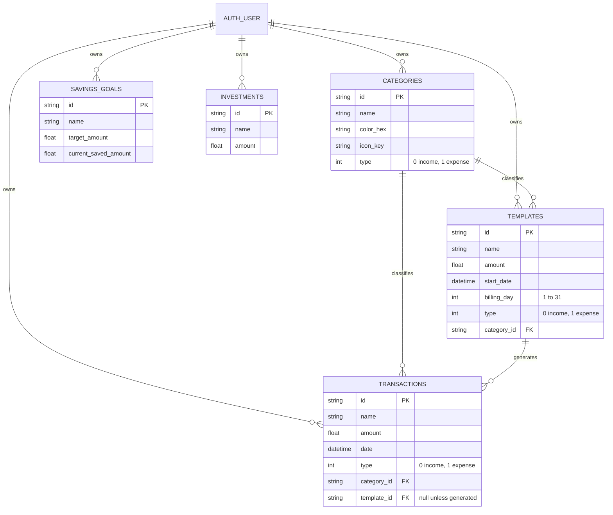

# Data model

The same data lives in two places: a **local SQLite database** (managed by Drift, defined in
[`lib/database.dart`](../lib/database.dart)) and **Supabase Postgres tables** that mirror it. This page
covers both, plus the conventions and migrations that connect them.

**Contents**

- [Entity relationships](#entity-relationships)
- [Conventions shared by every table](#conventions-shared-by-every-table)
- [Local tables](#local-tables)
- [Enums](#enums)
- [Generated Dart classes](#generated-dart-classes)
- [Supabase tables](#supabase-tables)
- [Naming across layers](#naming-across-layers)
- [Migrations](#migrations)

---

## Entity relationships



The diagram shows each table's business columns. **Every table also has** `user_id`, `is_synced`, `is_deleted` and `updated_at` (plus `is_active`, except on `transactions`); see [conventions](#conventions-shared-by-every-table) below.

`AUTH_USER` is Supabase's `auth.users`. It has no local table; the app only stores the user's ID on each row.

One more local table, `sync_cursors`, tracks sync progress and has no relationships (see [below](#sync_cursors)).

## Conventions shared by every table

Every synced table follows the same pattern, which is what lets one [sync engine](sync.md) and one
[`BaseDao`](../lib/daos/base_dao.dart) serve all of them.

| Column | Type | Meaning |
|---|---|---|
| `id` | text | The primary key, a **UUID v4 generated on the device** (`clientDefault(() => Uuid().v4())`), so rows can be created offline without asking a server. |
| `user_id` | text | Who owns the row. **Every query filters on it.** |
| `is_synced` | bool | `false` = changed locally and not uploaded yet. Local only; never sent to Supabase. |
| `is_deleted` | bool | **Soft delete.** The row stays, hidden from queries, so the deletion can sync to other devices. |
| `is_active` | bool | For hiding without deleting. Queries respect it; no screen toggles it yet, so it is always `true` today. (Not on `transactions`.) |
| `updated_at` | datetime | When the row was last changed **on a device**. Sync uses it for "newest edit wins". Must move forward on every update (see [`nextUpdatedAt`](sync.md#rules-for-changing-rows)). |

Notes:

- **Dates** are stored by Drift as Unix **seconds**, so sub-second precision is lost. That is why
  `nextUpdatedAt` always advances by at least one second.
- **Money** is a `REAL` (double). Fine for a personal tracker; a real accounting system would use integer cents.
- **Foreign keys** (`category_id`, `template_id`) are declared with `.references(...)`, which documents the relationship and
  appears in the schema. SQLite only *enforces* foreign keys when `PRAGMA foreign_keys = ON`, and this app doesn't set it. In
  practice the UI keeps the data consistent (forms only offer existing categories), but the database itself would not reject a
  dangling `category_id`. Deleting a category is a soft delete, so its transactions keep their `category_id`.

## Local tables

### `categories`

| Column | Type | Notes |
|---|---|---|
| `name` | text | Display name |
| `color_hex` | text | Six hex digits **without** `#` (e.g. `4CAF50`). Converted with `AppConstants.getColorFromHex` / `colorToHex`. |
| `icon_key` | text | A key of `AppConstants`'s icon map (20 icons, e.g. `restaurant`). Unknown keys show a help icon. |
| `type` | int | `TransactionType`. **Decides whether transactions in this category count as income or spending.** |

### `transactions`

| Column | Type | Notes |
|---|---|---|
| `name` | text | |
| `amount` | real | Always positive. The `type` gives the direction. |
| `date` | datetime | Which month's ledger it appears in. |
| `type` | int | Copied from the category when created through the form; from the template when generated. |
| `category_id` | text | FK to `categories`. |
| `template_id` | text? | Set only on transactions **generated from a fixed transaction**. `NULL` for ones added by hand. |

### `templates` (fixed transactions)

| Column | Type | Notes |
|---|---|---|
| `name`, `amount`, `type`, `category_id` | | Copied onto each generated transaction. |
| `start_date` | datetime | Defaults to now. No transaction is generated for months before it. |
| `billing_day` | int | 1 to 31. Days beyond a month's length use its last day. |

### `savings_goals`

| Column | Type | Notes |
|---|---|---|
| `name` | text | |
| `target_amount` | real | |
| `current_saved_amount` | real | Entered by hand. |

### `investments`

| Column | Type | Notes |
|---|---|---|
| `name` | text | |
| `amount` | real | |

### `sync_cursors`

Not a synced table. It remembers **how far each table has been downloaded** from Supabase.

| Column | Type | Notes |
|---|---|---|
| `scope` (PK) | text | `"<userId>:<tableName>"`, e.g. `3a03...:transactions`. Each user on a device has their own position per table. |
| `cursor` | text | The newest `server_updated_at` seen, kept as the **raw string** so Drift can't round it to whole seconds. |

## Enums

```dart
enum TransactionType { income, expense }
```

Stored as an integer through `intEnum<TransactionType>()`: **`income = 0`, `expense = 1`**. The same integers are
stored in Supabase. **Never reorder or insert values in the middle of this enum**; that would silently flip
every existing row. Only append new values at the end.

## Generated Dart classes

Drift turns each table into several classes (in `database.g.dart`). Table `Categories` gives:

| Generated class | Use |
|---|---|
| `Category` | An immutable **row** you read (with `copyWith`) |
| `CategoriesCompanion` | A partial row you **insert or update**; each field is a `Value<T>` (present or absent) |
| `$CategoriesTable` | The table definition used inside queries |

The same pattern applies to `Transaction`/`TransactionsCompanion`, `Template`/`TemplatesCompanion`,
`SavingsGoal`/`SavingsGoalsCompanion` and `Investment`/`InvestmentsCompanion`.

Hand-written types built on top:

| Type | Where | Purpose |
|---|---|---|
| `TransactionWithCategory` | `daos/transactions_dao.dart` | A transaction joined with its category, for the ledger. |
| `DashboardMetrics` | `daos/transactions_dao.dart` | A Dart record `({double income, double expense, double cashFlow})` for the summary cards. |
| `YearMonth` | `providers/transaction_providers.dart` | A record `({int year, int month})` used as the key of the per-month providers. |
| `ServerRow<D>` | `daos/base_dao.dart` | A row downloaded from Supabase, already converted to a companion, plus its `updatedAt`. |

## Supabase tables

Each mirrors its local table with three differences: **no `is_synced`** (a local-only concept), ids and
user ids are `uuid`, and there is an extra **`server_updated_at`**.

| Column | Postgres type | Set by |
|---|---|---|
| `id` | `uuid` primary key | the device |
| `user_id` | `uuid`, default `auth.uid()`, references `auth.users` (cascade delete) | the device |
| `updated_at` | `timestamptz not null default now()` | **the device** (its edit time) |
| `server_updated_at` | `timestamptz not null default now()` | **a trigger** (`set_server_updated_at`), on every insert or update |
| everything else | same as the local column (`text`, `integer`, `double precision`, `boolean`, `timestamptz`) | the device |

Keys sent by the app for each table (see `sync_engine.dart`):

| Table | Columns uploaded |
|---|---|
| `categories` | `id, name, color_hex, icon_key, type, user_id, is_active, is_deleted, updated_at` |
| `templates` | `id, name, amount, start_date, billing_day, type, category_id, user_id, is_active, is_deleted, updated_at` |
| `transactions` | `id, name, amount, date, type, category_id, user_id, template_id, is_deleted, updated_at` |
| `savings_goals` | `id, name, target_amount, current_saved_amount, user_id, is_active, is_deleted, updated_at` |
| `investments` | `id, name, amount, user_id, is_active, is_deleted, updated_at` |

**What is (and isn't) in this repository**

- `savings_goals` and `investments` are created by
  [the migration](../supabase/migrations/20260924000000_offline_sync.sql), including their RLS policies.
- `categories`, `templates` and `transactions` were created earlier in the Supabase dashboard. The migration
  only *adds* their timestamp columns, trigger and index. Their base definitions are not versioned here.

**Row Level Security.** Every table must only let a user read and write rows where `auth.uid() = user_id`.
The migration creates exactly that policy for the two tables it makes:

```sql
create policy "Users manage their own savings goals" on public.savings_goals
  for all using (auth.uid() = user_id) with check (auth.uid() = user_id);
```

The anon key in the app is public by design; this policy is what actually protects the data.

**Index.** Each table has `(user_id, server_updated_at)`, which is exactly what the sync pull asks
("this user's rows changed since X").

## Naming across layers

The same field has three spellings:

| Dart (Drift row / companion) | SQLite column | Supabase column and JSON key |
|---|---|---|
| `colorHex` | `color_hex` | `color_hex` |
| `isDeleted` | `is_deleted` | `is_deleted` |
| `updatedAt` | `updated_at` | `updated_at` |
| `templateId` | `template_id` | `template_id` |

Drift converts camelCase to snake_case for the SQLite column. The sync engine's `toJson` / `fromJson` write the
snake_case names directly. When you write **raw SQL** (as `BaseDao` does), use the snake_case names.

Timestamps travel as **UTC ISO-8601 strings** (`toUtc().toIso8601String()`) and are converted back with `.toLocal()`.

## Migrations

`AppDatabase.schemaVersion` is currently **3**. A fresh install runs `onCreate` (`createAll`). An existing
install runs `onUpgrade` for the steps it hasn't seen.

| Version | What changed | How |
|---|---|---|
| **1** | Original schema: categories, transactions, templates, savings goals, investments. No `updated_at`. | n/a |
| **2** | Added `updated_at` to every table; created `sync_cursors`. | SQLite can't `ADD COLUMN` with a "now" default, so `alterTable` rebuilds each table and fills existing rows with the current time. |
| **3** | **Data repair, no schema change.** The Add Transaction form used to save every transaction as an expense, even in income categories. | One SQL `UPDATE` sets each hand-added transaction's type to its category's type. Repaired rows are marked unsynced with a newer `updated_at`, so the fix uploads and wins over the old server copy. Generated (template) transactions are left alone, since they always had the right type. |

The upgrade paths are tested in [`test/database/migration_test.dart`](../test/database/migration_test.dart) using a
frozen copy of the version 1 schema ([`test/helpers/schema_v1.dart`](../test/helpers/schema_v1.dart)), which
must never be edited, because it has to match what is already on people's devices.

**To change a table:** edit it in `database.dart`, bump `schemaVersion`, add an `if (from < N)` step, run
`build_runner`, add a migration test, and update the Supabase table and this page.
