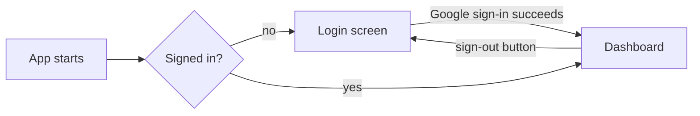
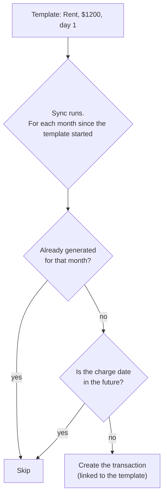

# Features and workflows

This page describes what the app does from a user's point of view, and how each flow works
underneath. For the reasons behind the design see [Design decisions](design-decisions.md).

**Contents**

- [Signing in](#signing-in)
- [The Dashboard](#the-dashboard)
- [Adding a transaction](#adding-a-transaction)
- [The monthly ledger](#the-monthly-ledger)
- [Settings](#settings)
- [Fixed transactions](#fixed-transactions)
- [Working offline and syncing](#working-offline-and-syncing)
- [Multiple accounts](#multiple-accounts)
- [Themes and layout](#themes-and-layout)
- [Known limitations](#known-limitations)

---

## Signing in

The app uses **Google sign-in only**. What happens behind the button depends on the platform
([`lib/screens/login.dart`](../lib/screens/login.dart)):

| Platform | Flow |
|---|---|
| Android / iOS | Native Google account picker (`google_sign_in`), then the resulting ID token is exchanged with Supabase (`signInWithIdToken`). |
| Windows / Linux | Opens the browser for Supabase's Google OAuth, then Google redirects back to the app through the custom URL scheme `com.butters.expense-tracker://login-callback`. |
| macOS / web | Take the same code path as Android and iOS. These platforms are scaffolded but are not a focus. |

[`AuthGate`](../lib/screens/auth_gate.dart) decides what to show: a spinner while the first auth
state loads, the **Login** screen when signed out, and the **Dashboard** when signed in. There is no
navigation code for sign-in or sign-out. The gate simply reacts when the session changes.

> When the device is offline, Supabase cannot refresh the session token. The app treats this as
> "still signed in" (the saved session is kept), so you can keep working offline.

## The Dashboard

The main screen ([`lib/screens/dashboard.dart`](../lib/screens/dashboard.dart)) has, top to bottom:

1. **Three summary cards for the current month:** *Monthly Income*, *Total Transaction* (spending)
   and *Cash Flow* (income minus spending).
2. **The Add Transaction form** and, next to it, the **category filter chips** and the
   **monthly ledgers**.

**App bar buttons**, left to right: the sync status cloud, Settings, the light/dark toggle, and sign out.

The layout adapts to the screen width (breakpoint **600 px**):

| | Narrow (phone) | Wide (desktop / tablet) |
|---|---|---|
| Summary cards | Stacked vertically | In one row |
| Add Transaction | Floating **+** button opens a bottom sheet | Form pinned on the left |
| Filter chips + ledgers | Ledgers only | Right of the form, chips above the ledgers |

## Adding a transaction

The form ([`lib/widgets/add_expense_dialog.dart`](../lib/widgets/add_expense_dialog.dart)) asks for a
**name**, an **amount** (digits with up to two decimals) and a **category**.

Two rules are worth knowing:

- **The category decides the type.** A transaction in an *income* category is saved as income and
  adds to your income total. One in an *expense* category is saved as an expense. There is no
  separate Income/Expense switch on this form. (Older versions saved everything as an expense; a
  one-time database upgrade repaired those rows. See [migration v3](data-model.md#migrations).)
- **The date is "now".** The transaction is dated the moment you add it.

If there are no categories yet the form asks you to create one in Settings first. Adding never
needs the network: the row is saved locally and marked *unsynced*, then uploaded later.

## The monthly ledger

Each month from the current one back to the start month is an expandable card
([`lib/widgets/ledger_list.dart`](../lib/widgets/ledger_list.dart)). The current month starts
expanded.

- **Header:** month name plus *Income*, *Transactions* (spending) and *Cash Flow* for that month.
  Cash flow is green while income covers your spending and turns red once you spend more than you earn.
- **Income section:** every income transaction of the month, with an **Add Fixed** shortcut that
  opens the fixed-transaction form pre-set to *Income*.
- **Transactions section:** the month's expenses, newest first, with a **Total** row. Selecting a
  [category filter chip](#the-dashboard) switches it to that category's transactions.
- **Deleting** a transaction removes it immediately and shows a snackbar. It is a *soft delete*
  (the row is hidden and marked for sync so the deletion reaches your other devices).

Amounts are colored (green for income, red for expenses) **and** carry a sign (`+$12.00`,
`-$12.00`), so they are still readable for anyone who cannot tell the two colors apart.

## Settings

[`lib/screens/settings.dart`](../lib/screens/settings.dart) manages the four kinds of data behind
the Dashboard. Each panel lists its rows with **edit** and **delete** buttons and has an **Add**
button. Deleting always asks for confirmation first, and the message says the item "will be deleted
on all your devices".

| Panel | Fields | Notes |
|---|---|---|
| **Categories** | Name, Income/Expense type, color (color wheel), icon (from 20 built-ins) | The icon is drawn in black or white, whichever is readable on the chosen color. |
| **Fixed Transactions** | Name, amount, day of the month (1 to 31), Income/Expense type, category | See [below](#fixed-transactions). |
| **Savings Goals** | Name, target amount, saved so far | Amounts are typed by hand for now. |
| **Investments** | Name, amount | A simple list for now. |

All forms share one frame ([`FormDialogScaffold`](../lib/widgets/forms/form_helpers.dart)): they
validate before saving, show a spinner while saving, and report an error in a snackbar if saving
fails.

## Fixed transactions

A **fixed transaction** (internally a *template*) is something that repeats every month: rent, a
salary, a subscription. You define it once, and the app creates the real transaction each month.

Rules ([`TransactionsDao.generateFixedTransactionsForMonth`](../lib/daos/transactions_dao.dart)):

- A template starts in the month it was created. **The past is never back-filled.**
- Generation happens as part of every sync, so opening the app after a few months away creates the
  missing months.
- A day that doesn't exist in a month uses that month's last day (day 31 becomes Feb 28 or 29, Apr 30).
- **Only active, non-deleted templates** of the signed-in user are used.
- Deleting a template **stops future months**. Transactions it already created stay.
- The created transaction gets a deterministic ID, so two offline devices that both generate
  "Rent, March" end up with a single row after syncing. See [Sync](sync.md#fixed-transactions-and-deterministic-ids).

## Working offline and syncing

The app never waits on the network. Every screen reads the local database; changes are marked
*unsynced* and uploaded in the background. The **cloud icon** in the app bar tells you where things stand:

| Icon | Meaning |
|---|---|
| Cloud with a check | Everything is synced (tooltip shows when it last synced) |
| Cloud with an up-arrow and a number badge | *N* changes are waiting to upload |
| Cloud with sync arrows | A sync is running |
| Cloud with a slash | Offline; changes will upload when you're back online |
| Warning sync icon | The last sync failed; tap to retry (tooltip shows why) |

**Tap the icon to sync right away.** A message always follows the tap: *Everything is synced*,
*You're offline...*, *Sync failed: ...*, or *Synced, but N changes are still waiting*.

A sync also starts on its own:

- when you sign in or open the app,
- when the network comes back,
- when the app returns to the foreground,
- about **3 seconds after you make a change** (a burst of edits becomes one sync),
- every **5 minutes**, to pick up changes made on other devices.

The details are in [Sync engine](sync.md).

## Multiple accounts

Every row belongs to a user, and every query filters by the signed-in user's ID. Signing out and
signing in as someone else swaps all screens to that person's data without restarting. Two people can
share one device and never see each other's rows. The local database keeps each user's sync position
separately.

## Themes and layout

- **Light / dark:** the moon button in the app bar toggles between them. The starting mode follows
  the system setting.
- **Money colors** (green for money in, red for money out) are defined per theme in
  [`MoneyColors`](../lib/theme/money_colors.dart), using darker shades on light backgrounds and
  lighter shades on dark ones, so text stays readable in both.
- **Fonts:** Public Sans through `google_fonts`.

## Known limitations

These are deliberate simplifications or open items, not hidden bugs:

| Limitation | Why / context |
|---|---|
| Transactions can't be edited, only added and deleted | There is no edit form for transactions yet. Categories, fixed transactions, goals and investments *can* be edited. |
| A transaction's date is always "now" | The Add form has no date picker. |
| The Dashboard starts at March 2026 | `_startMonth` in `dashboard.dart` is a fixed date, marked with a TODO to derive it from the user's first transaction. |
| The light/dark choice isn't saved | `ThemeModeNotifier` starts on "system" on each launch. |
| Savings goals and investments are not linked to transactions | They are standalone lists for now. |
| "Newest edit wins" trusts device clocks | There is no server-side arbitration. See [Sync limitations](sync.md#limitations). |
| Fixed transactions generated before deterministic IDs were introduced have random IDs | Existing duplicates (if any) won't merge automatically. |
