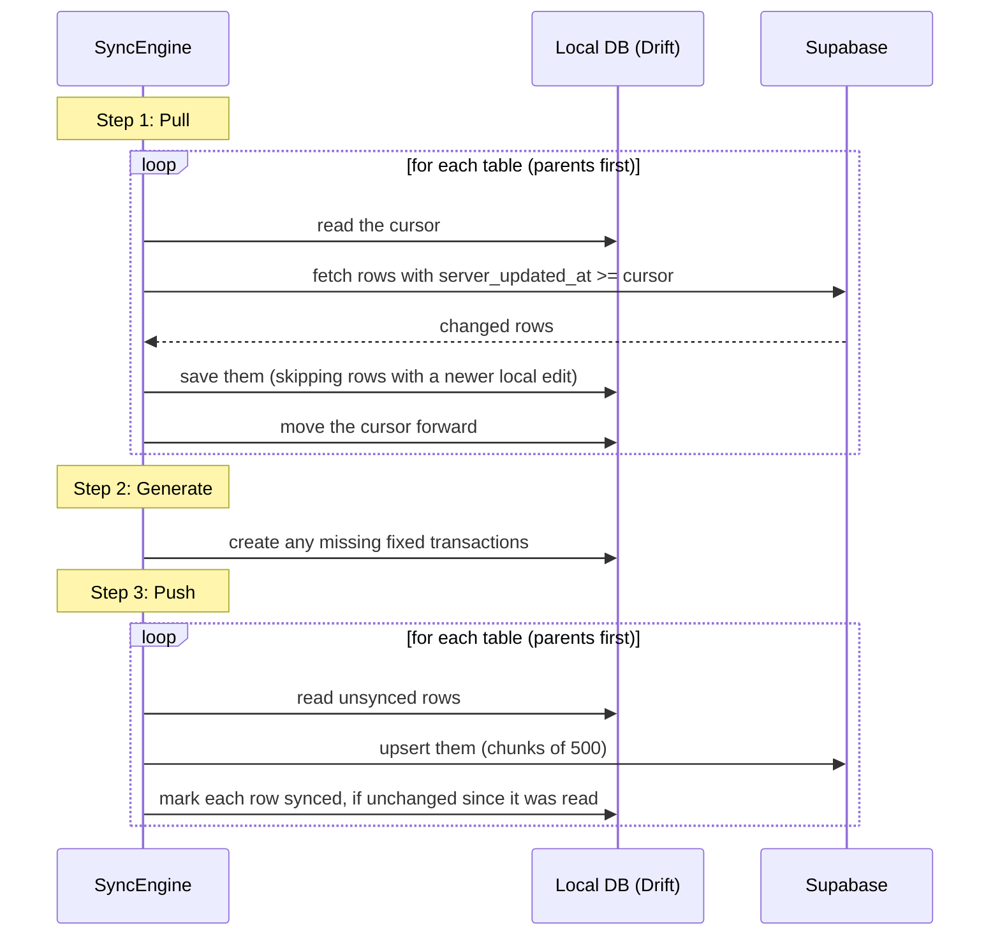
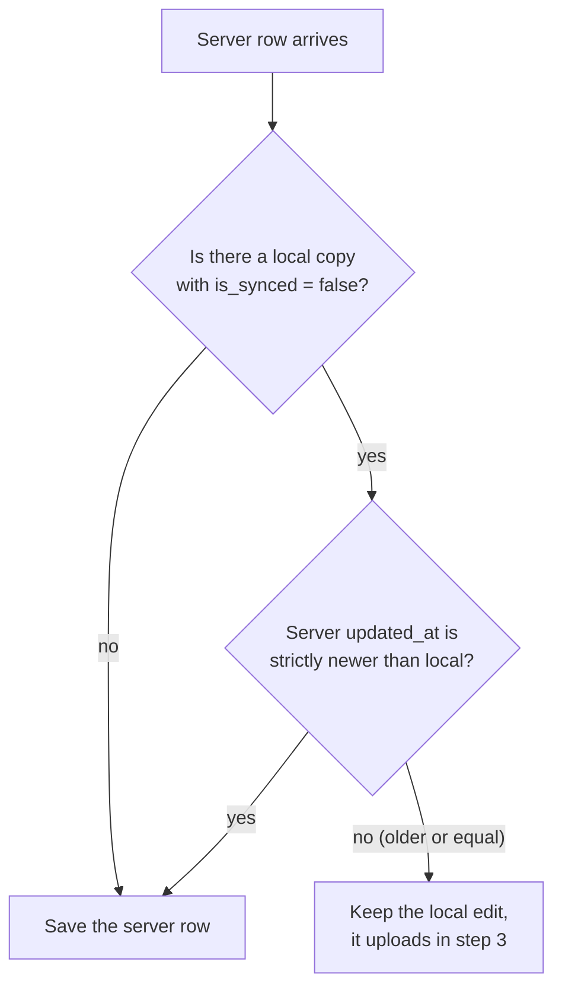
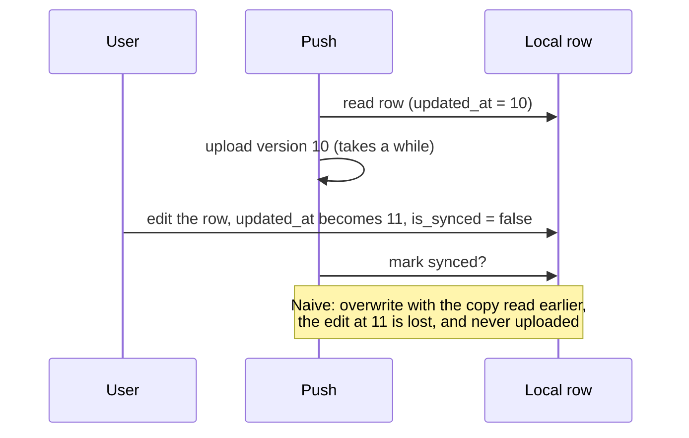
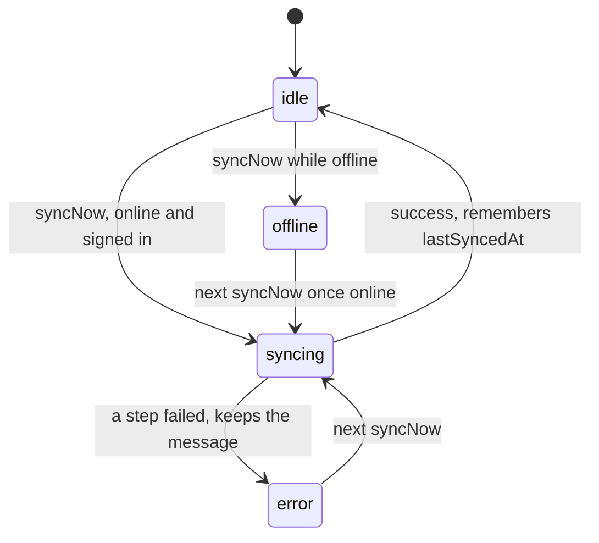

# Sync engine

How the app keeps the local database and Supabase in step, without ever making the user wait.

**Contents**

- [Goals](#goals)
- [Vocabulary](#vocabulary)
- [The three steps](#the-three-steps)
- [Pulling](#pulling)
- [Conflicts: which edit wins](#conflicts-which-edit-wins)
- [Pushing, and the in-flight edit race](#pushing-and-the-in-flight-edit-race)
- [Fixed transactions and deterministic IDs](#fixed-transactions-and-deterministic-ids)
- [Deleting](#deleting)
- [When sync runs: SyncController and SyncTriggers](#when-sync-runs-synccontroller-and-synctriggers)
- [Errors and offline behaviour](#errors-and-offline-behaviour)
- [Rules for changing rows](#rules-for-changing-rows)
- [Adding a new synced table](#adding-a-new-synced-table)
- [Limitations](#limitations)

Code: [`lib/sync_engine.dart`](../lib/sync_engine.dart) (the *how*),
[`lib/providers/sync_providers.dart`](../lib/providers/sync_providers.dart) (the *when* and the status),
[`lib/widgets/sync_triggers.dart`](../lib/widgets/sync_triggers.dart) and
[`lib/widgets/sync_status_button.dart`](../lib/widgets/sync_status_button.dart) (the UI hooks),
[`lib/daos/base_dao.dart`](../lib/daos/base_dao.dart) (the conflict-safe writes).

---

## Goals

1. **Local first:** every screen works with no network; the database on the device is the source the UI reads.
2. **No lost edits:** if two devices change the same row, or an edit happens while an upload is in flight, nothing is silently dropped.
3. **Cheap:** download only what changed since last time, not the whole table.
4. **Automatic but observable:** it runs on its own, and the cloud icon always tells the truth.
5. **Safe to repeat:** every step can be re-run after a crash or a failed request and gives the same result.

## Vocabulary

| Term | Meaning |
|---|---|
| **Unsynced row** | A local row with `is_synced = false`: created or changed here and not yet uploaded. |
| **`updated_at`** | When a *device* last edited the row. Sent by the app. Decides who wins in a conflict. |
| **`server_updated_at`** | When the *server* last received the row. Set by a database trigger, never by the app. Used to ask "what changed since X". |
| **Cursor** | The newest `server_updated_at` this device has downloaded for a table, stored per user in `sync_cursors`. |
| **Pull / Push** | Download server changes / upload local changes. |

Why two timestamps? A device that was offline for a week uploads edits it made last Tuesday. Their `updated_at`
is old, so "give me rows with `updated_at` after my last sync" would never show them to other devices.
`server_updated_at` is the time they *arrived*, which is always recent. See
[Design decisions](design-decisions.md#13-two-timestamps-updated_at-and-server_updated_at).

## The three steps

`SyncEngine.runSync(userId)` does the following, in this order:



**Why this order?** Pulling first means we see the other devices' newest edits *before* we upload ours, so
a stale local edit doesn't overwrite a newer server row. Generating in the middle means the transactions it
creates are uploaded in the same run. **Tables are processed parents before children** (categories, templates,
transactions, savings goals, investments), so a transaction is never uploaded before the category it points to.

## Pulling

For each table ([`_SyncTable.pull`](../lib/sync_engine.dart)):

1. Read this user's cursor for the table (`sync_cursors` row `"<userId>:<table>"`). No row means "everything".
2. Ask Supabase for the user's rows with `server_updated_at >= cursor`, oldest first, **1000 per page**, until a
   short page arrives.
3. Convert them and hand them to `BaseDao.saveServerRows`, which applies the [conflict rule](#conflicts-which-edit-wins)
   inside a database transaction.
4. **Only then** move the cursor to the last row's `server_updated_at`.

Details that matter:

- The cursor moves **after** the rows are safely saved. If the app dies in between, the next run downloads the
  same rows again. That is harmless because saving is idempotent (`insertOrReplace`).
- The comparison is `>=` (inclusive) on purpose. All rows written by one upsert share the same server timestamp
  (`now()` is fixed for the whole statement), so a strict `>` could skip rows that share the cursor's timestamp.
  Re-downloading the boundary row each time is the cheap price.
- The cursor is stored as a **string**, because Drift rounds `DateTime` to whole seconds and that would lose precision.
- Each user on the device has their own cursors, so signing in as someone else doesn't reuse another account's position.

## Conflicts: which edit wins

A pulled row is compared with the local copy of the same `id`
([`BaseDao.saveServerRows`](../lib/daos/base_dao.dart)):



- A synced local row is simply replaced by the server's copy.
- On a **tie** the local edit is kept. Both devices then hold the same content or the local one goes up next, so the
  outcome is stable either way.
- The check and the write run **inside one database transaction**. Drift serializes writes, so the user cannot edit a
  row in the moment between "we checked it" and "we overwrote it".

This is **last write wins by `updated_at`**, at whole-row granularity (not per field).

## Pushing, and the in-flight edit race

For each table ([`_SyncTable.push`](../lib/sync_engine.dart)): read the unsynced rows, upsert them in chunks of 500,
and mark each one synced.

The subtle part is *marking synced*. Consider this timeline:



The fix is in [`BaseDao.markAsSynced`](../lib/daos/base_dao.dart), which is a single conditional statement:

```sql
UPDATE <table> SET is_synced = 1 WHERE id = ? AND updated_at = ?
```

If the row changed while the upload was in flight, `updated_at` no longer matches, **nothing is updated**, the row
stays unsynced, and the newer version goes up in the next run. It also only flips one flag, so it can't overwrite
anything else.

## Fixed transactions and deterministic IDs

Step 2 ([`syncAllTransactionsFromTemplates`](../lib/sync_engine.dart)) walks every month from the user's earliest
transaction to now and calls `generateFixedTransactionsForMonth` for each. That method creates a transaction for every
active template that has no transaction for that month yet, whose start month has arrived and whose charge date has passed.

The generated transaction's ID is **not random**:

```dart
String fixedTransactionId(String templateId, int year, int month)
{
  return const Uuid().v5(_fixedTransactionNamespace, "$templateId:$year-$month");
}
```

A UUID v5 is a hash of its input, so "Rent, March 2026" produces the **same ID on every device**. Without this, two
devices that were both offline would each create their own "March rent" with different random IDs, and after syncing you
would have two. With it, the second device's upload is an upsert of the same row.

## Deleting

Nothing is ever hard-deleted by the UI. Deleting sets `is_deleted = true`, `is_synced = false` and moves `updated_at`
forward, and the row syncs like any other edit. Other devices receive `is_deleted = true` and their queries hide it.
Generic soft deletes use [`BaseDao.softDeleteById`](../lib/daos/base_dao.dart):

```sql
UPDATE <table>
SET is_deleted = 1, is_synced = 0, updated_at = MAX(?, updated_at + 1)
WHERE id = ? AND user_id = ?
```

The `MAX(now, updated_at + 1)` guarantees the timestamp moves forward even if the row was edited earlier in the same second.

## When sync runs: SyncController and SyncTriggers

Two small classes separate *when* from *how*:

- **`SyncEngine`** knows how to sync. It has no idea when it is called.
- **[`SyncController`](../lib/providers/sync_providers.dart)** (a Riverpod `Notifier<SyncState>`) is the single place that decides
  when. It guarantees **one sync at a time**, and exposes the status the UI shows.
- **[`SyncTriggers`](../lib/widgets/sync_triggers.dart)** is a widget wrapped around the signed-in app. Because it only exists
  while someone is signed in, signing out stops all syncing automatically.

| Trigger | Mechanism |
|---|---|
| App opens / user signs in | `syncNow()` after the first frame |
| Network comes back | `ref.listen(isOnlineProvider)` sees `false` then `true` |
| App returns to the foreground | `AppLifecycleListener(onResume: ...)` |
| A local edit | `ref.listen(pendingChangesProvider)` sees the count **go up**, then `scheduleSync()` (**3 second** debounce) |
| Periodic | A 5-minute `Timer.periodic`, to pick up changes made on other devices |
| The user taps the cloud | `syncNow()` immediately |

Two details keep this from misbehaving:

- **Single flight.** If `syncNow()` is called while a sync is running, it doesn't start another; it sets a flag, and when the
  running sync finishes exactly **one** more runs. Ten quick requests become at most two syncs.
- **Only edits trigger, not uploads.** The pending count rising means a local edit. It *falling* means a sync just uploaded
  rows, which must not start another sync (that would loop forever). The listener ignores decreases.



`SyncState` holds `status` (`idle`, `syncing`, `offline`, `error`), `lastSyncedAt` and `errorMessage`.

### The status button

[`SyncStatusButton`](../lib/widgets/sync_status_button.dart) combines three inputs: the sync state, the number of pending
changes (`pendingChangesProvider`, a live `COUNT(*)` over every table's unsynced rows) and connectivity.
Tapping it calls `syncNow()` and then shows a snackbar describing the outcome, so the result is never left to a small icon change.

## Errors and offline behaviour

- **One failure doesn't block the rest.** `runSync` wraps each step (`pull categories`, `generate fixed transactions`,
  `push transactions`, ...) in `attempt(...)`, collects any errors, and throws a single `SyncException` at the end. The rows
  of a failed table simply stay unsynced and go up next time.
- **Timeouts.** Every Supabase request has a 30 second limit. Without it, a request that never answers (bad signal, a captive
  Wi-Fi page) would keep the sync "running" forever, and every later tap would wait behind it.
- **Offline.** If `isOnlineProvider` is false the controller sets the `offline` status and skips the run. Connectivity here means
  "the device has a network", not "Supabase is reachable"; a sync can still fail while online, and that is fine, because it
  simply retries later.
- **Auth while offline.** Failed session-refresh errors are filtered out of `authStateProvider`, so being offline doesn't sign the user out.

## Rules for changing rows

Anything that writes to a synced table must follow these, otherwise sync will not notice the change:

| Operation | Must do | How |
|---|---|---|
| **Insert** | Set `user_id`; `updated_at` and `is_synced` default correctly | Use an `XxxActions.add` (it calls `requireUserId()`) |
| **Update** | Set `isSynced: false` **and** `updatedAt: nextUpdatedAt(old.updatedAt)` | `edited.copyWith(isSynced: false, updatedAt: nextUpdatedAt(edited.updatedAt))` |
| **Delete** | Soft delete | `BaseDao.softDeleteById(id, userId)` (or `TransactionsDao.softDelete`) |

```dart
DateTime nextUpdatedAt(DateTime previous)
{
  final now = DateTime.now();
  final minimum = previous.add(const Duration(seconds: 1));
  return now.isAfter(minimum) ? now : minimum;
}
```

`nextUpdatedAt` exists because Drift stores dates in whole seconds: two edits in the same second would get the same
`updated_at`, and sync couldn't tell which is newer. It always moves forward by at least a second. All the
`CategoryActions`, `TemplateActions`, `SavingsGoalActions` and `InvestmentActions` classes already do this.

## Adding a new synced table

Checklist (follow an existing table as a template):

1. **Table** in `database.dart` with `id`, `user_id`, `is_synced`, `is_deleted`, `updated_at` (and `is_active` if relevant). Bump `schemaVersion` and add a migration step.
2. **DAO** extending `BaseDao`, with `getUnsynced(String userId)`. Register both in `@DriftDatabase`, then run `build_runner`.
3. **`_SyncTable` entry** in `SyncEngine._tables`, with `toJson` and `fromJson`. Put it **after** any table it references.
4. **Supabase:** create the table with `user_id`, RLS policy, `updated_at`, `server_updated_at`, the trigger and the `(user_id, server_updated_at)` index (copy the loop in the migration file).
5. **`pendingChangesProvider`:** add the table to its list so the badge counts it.
6. **Actions class** following [the rules above](#rules-for-changing-rows), plus a provider for the live list.
7. **Tests:** an actions test, and a sync engine test using `FakeSyncRemote` (see [Testing](testing.md)).

## Limitations

| Limitation | Detail |
|---|---|
| **Device clocks are trusted** | "Newest wins" compares `updated_at` written by devices. A device with a wrong clock can win or lose unfairly. |
| **No server-side arbitration** | The upload is a plain upsert. If two devices upload the same row at nearly the same moment, the last upload wins. Pulling first makes this rare, not impossible. |
| **Whole-row conflicts** | Two devices editing *different fields* of one row still resolve to one whole row, not a merge. |
| **Not real-time** | Other devices' changes arrive on the next trigger or the 5-minute poll, not instantly. |
| **Soft-deleted rows are never purged** | They stay in both databases forever. |
| **"Online" means "has a network"** | See above. |
| **Old fixed transactions** | Ones generated before deterministic IDs existed have random IDs, so existing duplicates won't merge. |
